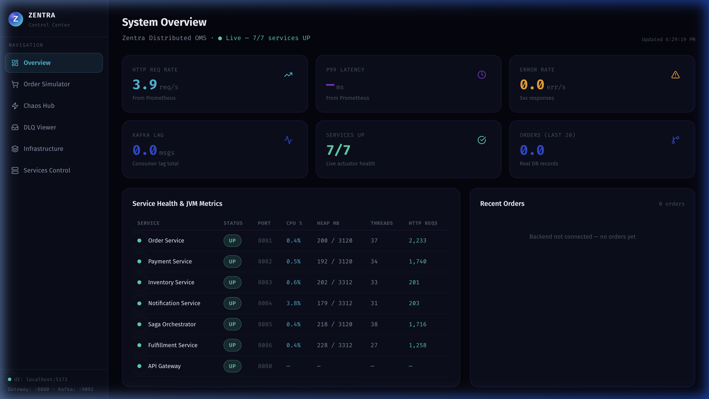
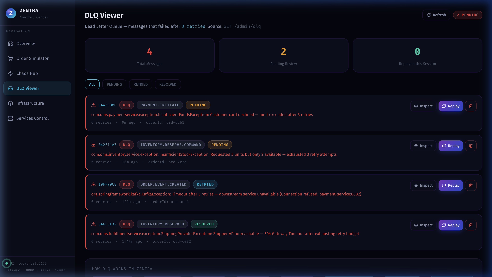
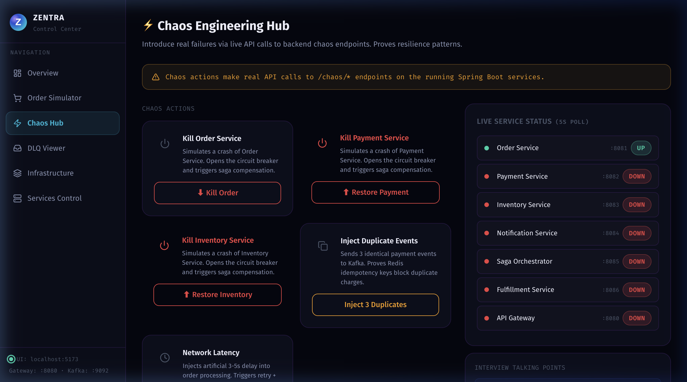
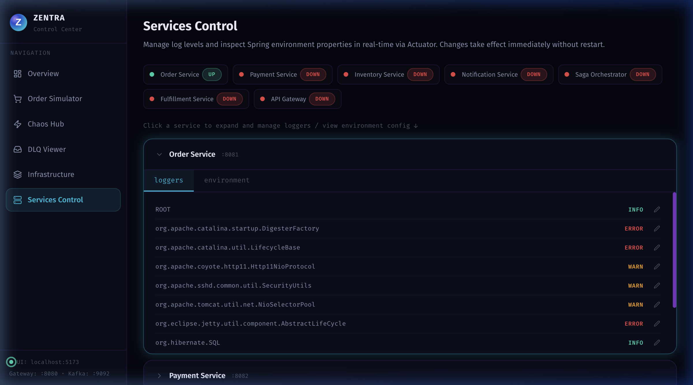
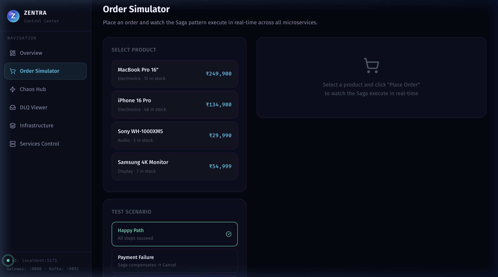
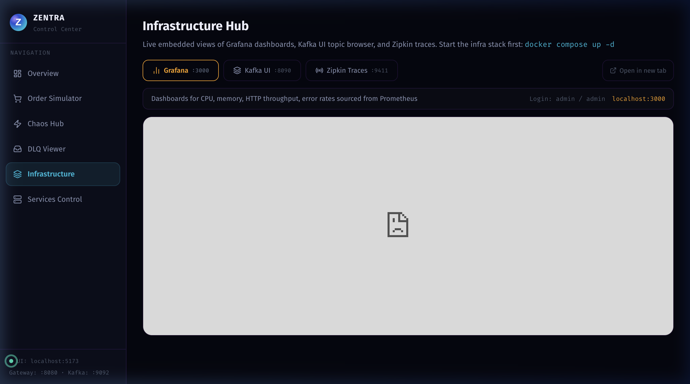

# Zentra — Distributed Order Management System

> A production-grade, event-driven microservices system with a real-time control center UI.

[](https://github.com/print-ramcharan/distributed-oms/tree/master)
[](#architecture)
[](#tech-stack)

---

## Live Control Center

### System Overview — All 7 Services UP

Real-time JVM metrics (CPU, Heap, Threads, HTTP requests) per service pulled from Spring Boot Actuator. Prometheus metrics (HTTP rate, Kafka consumer lag, error rate) updated every 5 seconds.



---

### DLQ Viewer — Dead Letter Queue Management

Messages that fail after 3 Kafka retry attempts land here. Inspect the raw payload, view the full exception, and replay directly back to Kafka or dismiss the record.



---

### Chaos Hub — Fault Injection

Kill individual services, inject artificial network latency (ms), or set a hard TPS throttle — all wired to real backend `/chaos/*` endpoints. Circuit breaker status updates live.



---

### Services Control — Live Log Level Management

Change any Spring logger's level (TRACE / DEBUG / INFO / WARN / ERROR) in real-time via `POST /actuator/loggers` — no restart needed. Also exposes full environment config per service.



---

### Order Simulator

Place orders with preset scenarios (Happy Path, Payment Failure, Stock Out) and watch them flow through the saga orchestrator in real time.



---

### Infrastructure Hub

Embedded live views of Grafana dashboards, Kafka UI (topic browser, consumer lag, message inspector), and Zipkin distributed traces — all in one place.



---

## Architecture

```
                     ┌─────────────────────────────────────────────┐
                     │         Zentra Control Center (React)         │
                     │         localhost:5173  (Vite dev proxy)      │
                     └──────────────────┬──────────────────────────┘
                                        │ REST + Actuator
               ┌────────────────────────┼────────────────────────┐
               ▼                        ▼                        ▼
        API Gateway :8080       Order Service :8081      Payment :8082
        (Spring Cloud)          (Saga initiator)         (Stripe-style)
               │                        │
               │              Kafka (localhost:9092)
               │         ┌──────────────┼──────────────┐
               ▼         ▼              ▼              ▼
         Inventory    Saga Orch.  Notification   Fulfillment
           :8083        :8085       :8084          :8086

Observability: Prometheus :9090 → Grafana :3000
Tracing:       Zipkin :9411
Kafka UI:      localhost:8090
```

**Saga Pattern**: Every order flows through a choreography saga across 4 services with compensating transactions on failure.  
**DLQ**: Failed Kafka events after 3 retries are persisted to Postgres and surfaced in the DLQ Viewer for manual replay.  
**Chaos Engineering**: Kill services, inject latency, throttle TPS — all controllable from the UI.

---

## Tech Stack

| Layer | Technology |
|-------|-----------|
| **Backend** | Spring Boot 4.0, Spring Kafka, Spring Data JPA, Spring Actuator |
| **Frontend** | React 18, Vite, TailwindCSS v4, Zustand, Recharts |
| **Messaging** | Apache Kafka 3.x (Zookeeper mode) |
| **Databases** | PostgreSQL 15 (one DB per service) |
| **Cache / Lock** | Redis 7 (rate limiting, distributed inventory lock) |
| **Observability** | Prometheus + Grafana, Zipkin (distributed tracing), Micrometer |
| **Gateway** | Spring Cloud Gateway (reactive, Redis rate limiting) |
| **Infra** | Docker Compose (14 containers) |

---

## Running Locally

### 1. Start Infrastructure

```bash
cd backend
docker compose up -d \
  zookeeper kafka redis zipkin prometheus grafana kafka-ui mailhog \
  order-db payment-db saga-db inventory-db notification-db fulfillment-db
```

### 2. Start Backend Services

Each service in its own terminal:

```bash
cd backend
java -jar services/order-service/target/order-service-*.jar
java -jar services/payment-service/target/payment-service-*.jar
java -jar services/inventory-service/target/inventory-service-*.jar
java -jar services/saga-orchestrator/target/saga-orchestrator-*.jar
java -jar services/notification-service/target/notification-service-*.jar
java -jar services/fulfillment-service/target/fulfillment-service-*.jar
java -jar services/gateway-service/target/gateway-service-*.jar
```

Or build first (if JARs don't exist):

```bash
cd backend && mvn package -DskipTests -T 4
```

### 3. Start Frontend

```bash
cd frontend && npm install && npm run dev
# → http://localhost:5173
```

---

## Service Ports

| Service | Port | DB Port |
|---------|------|---------|
| API Gateway | 8080 | — |
| Order Service | 8081 | 5433 |
| Payment Service | 8082 | 5434 |
| Inventory Service | 8083 | 5436 |
| Notification Service | 8084 | 5437 |
| Saga Orchestrator | 8085 | 5435 |
| Fulfillment Service | 8086 | 5438 |
| **Prometheus** | **9090** | — |
| **Grafana** | **3000** | — |
| **Kafka UI** | **8090** | — |
| **Zipkin** | **9411** | — |
| **Mailhog (SMTP UI)** | **8025** | — |
| **Redis** | **6379** | — |
| **Kafka** | **9092** | — |
