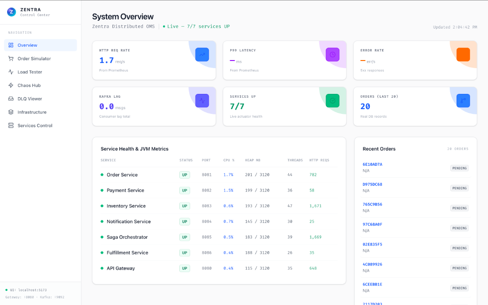
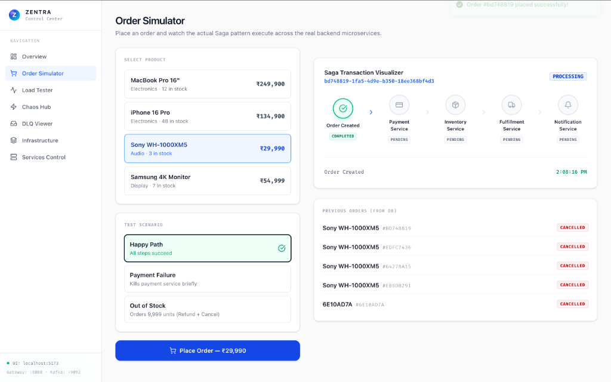
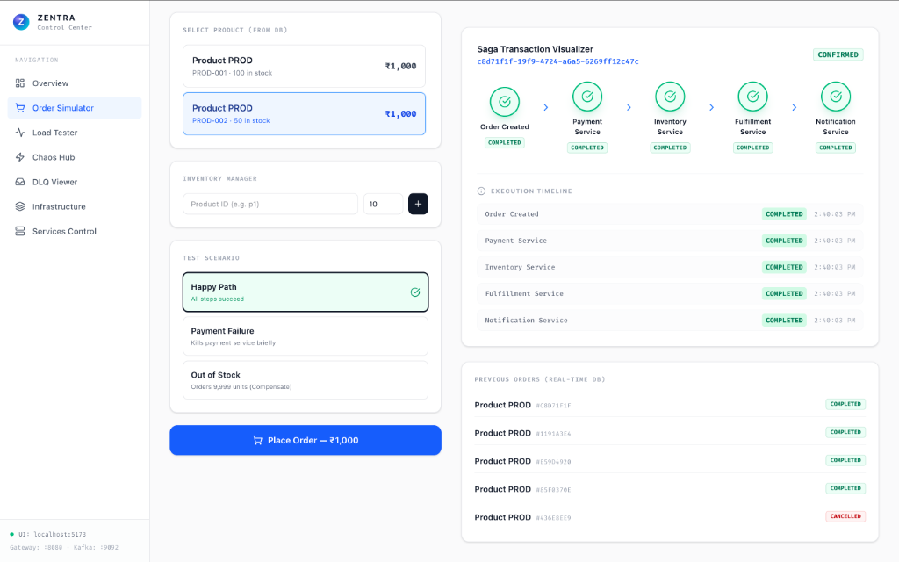
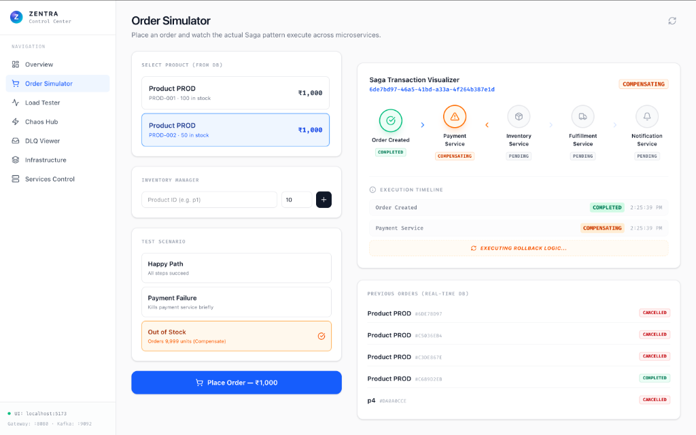
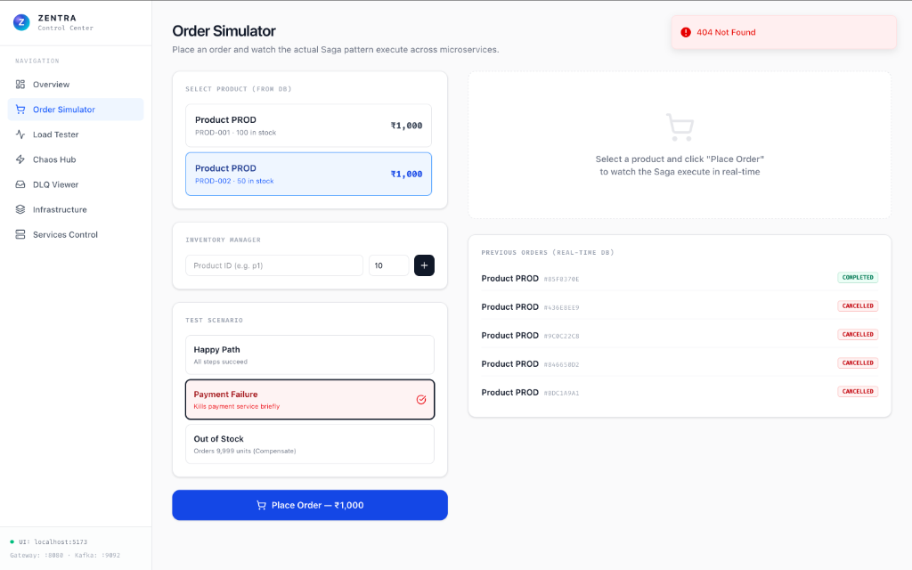
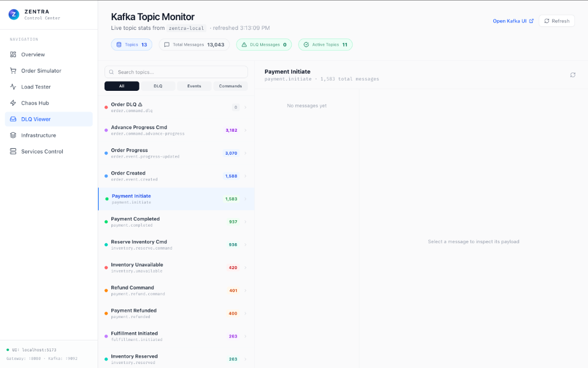
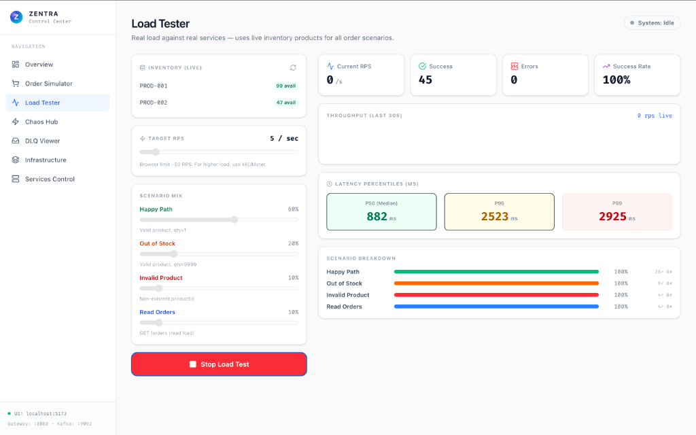
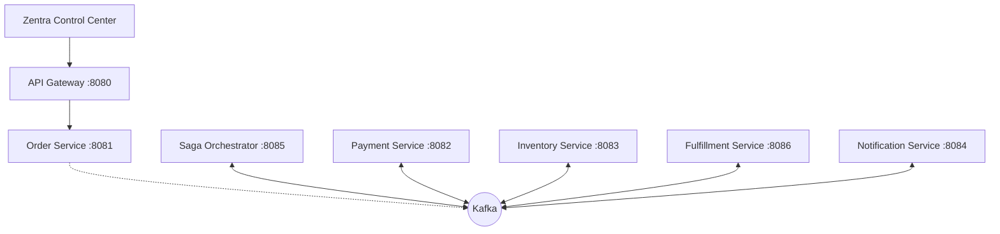

# Zentra - Distributed Order Management System (OMS)

A production-grade, event-driven microservices ecosystem demonstrating the **Saga Orchestration Pattern**. Built for extreme observability, Zentra provides a real-time Control Center to monitor distributed transaction lifecycles, Kafka event streams, and system capacity under sustained load.

[](https://github.com/print-ramcharan/distributed-oms/tree/master)
[](#architecture)
[](#tech-stack)

---

## Control Center

The Zentra Control Center is a centralized operations hub that provides deep visibility into the distributed state of the system, focusing on real-time transaction data and system health.

### System Health & Real-time Metrics
Monitor JVM metrics, request throughput, and error rates across all 7 microservices. Integrated with Prometheus and Spring Actuator for live telemetry and health monitoring.



---

### Order Simulation & Saga Lifecycle
Watch complex distributed transactions execute across microservices. Zentra visualizes the Saga state machine in real-time, providing clear insight into cross-service communication, transaction IDs, and execution timelines.



#### Real-time Database Audit
The system tracks the full history of orders directly from the database, showing the final state (Completed/Cancelled) for every transaction initiated by the simulator or load tester.



---

### Distributed Resilience (Rollback Logic)
When a downstream service fails or business rules are violated (e.g., Payment Failure), Zentra demonstrates industrial-grade resilience by triggering compensating transactions to restore system-wide consistency.



---

### Inventory Management
Manage system state directly through the Control Center. The Inventory Manager allows for real-time stock adjustments and product tracking, serving as the source of truth for the Saga Orchestrator.



---

### Kafka Telemetry & Event Streams
A live diagnostic tool for inspecting Kafka message streams. Built with Server-Sent Events (SSE), it allows developers to audit raw JSON payloads and metadata for all 13 system topics, processing thousands of events in real-time.



---

### Scenario-Based Load Tester
A background load generator designed to stress-test saga resilience. Monitor real-time performance metrics including throughput (RPS), success rates, and latency percentiles through dynamic sparklines.



---

## Architecture

Zentra is composed of 7 independent microservices communicating primarily via **Apache Kafka**.


```mermaid
graph TD
    UI[Zentra Control Center] --> GW[API Gateway :8080]
    GW --> OR[Order Service :8081]
    OR -.-> K((Kafka))
    SO[Saga Orchestrator :8085] <--> K
    PY[Payment Service :8082] <--> K
    IV[Inventory Service :8083] <--> K
    FL[Fulfillment Service :8086] <--> K
    NT[Notification Service :8084] <--> K
```

### Core Design Principles
- **Saga Orchestration**: Centralized coordination of distributed transactions using a state-machine driven Orchestrator.
- **Event-Driven Architecture**: Fully decoupled services using Kafka as the backbone for command and event propagation.
- **Observability First**: Deep integration with Spring Boot Actuator, Micrometer, and Prometheus for real-time visibility.
- **Resilience**: Automated retries, Dead Letter Queues (DLQ), and compensating transactions for all failure scenarios.

---

## Tech Stack

| Layer | Technology |
|:---|:---|
| **Backend** | Spring Boot 4.0, Spring Kafka, Spring Data JPA, Spring Actuator |
| **Frontend** | React 18, Vite, Tailwind CSS v4, Lucide Icons, Recharts |
| **Messaging** | Apache Kafka (Event Store & Message Broker) |
| **Databases** | PostgreSQL (Per-service isolated schemas) |
| **Cache & Lock** | Redis (Distributed locking & Rate Limiting) |
| **Observability** | Prometheus, Grafana, Zipkin (Distributed Tracing) |

---

## Getting Started

### 1. Infrastructure Setup
Spin up the 14-container environment using Docker Compose:
```bash
cd backend
docker compose up -d
```

### 2. Start Backend Services
```bash
cd backend
mvn clean package -DskipTests
# Run the individual service jars
```

### 3. Start Control Center
```bash
cd frontend
npm install
npm run dev
```

Visit `http://localhost:5173` to start simulating orders and monitoring system load.

---

© 2026 Zentra Distributed OMS.
