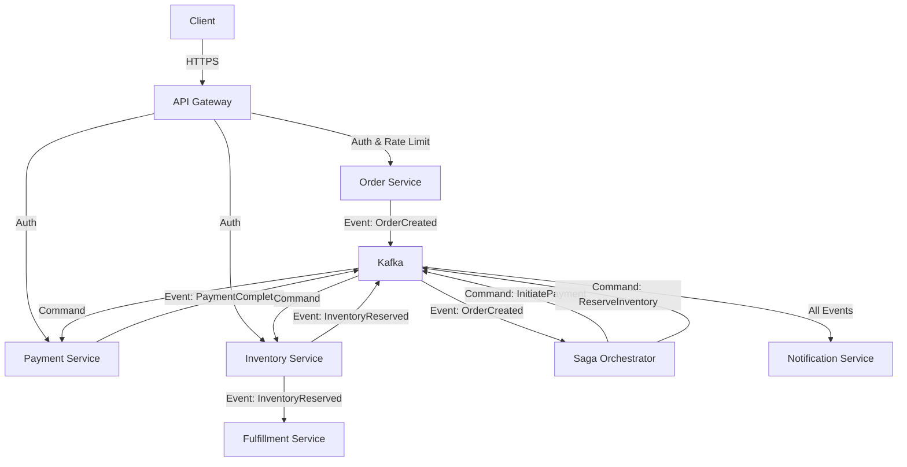

# Distributed Order Management System (OMS)

[]()
[]()
[]()
[]()
[]()

A production-grade, event-driven microservices architecture built to demonstrate **resilience**, **scalability**, and **distributed transaction patterns** (Saga). This system simulates a real-world e-commerce backend handling orders, payments, inventory, and fulfillment with robust failure handling and observability.

---

## Key Features

*   **Event-Driven Architecture**: Fully asynchronous communication using **Apache Kafka**.
*   **Saga Pattern**: Orchestrated distributed transactions (Order &rarr; Payment &rarr; Inventory &rarr; Fulfillment) with rollback capabilities.
*   **Resilience & Fault Tolerance**:
    *   **Circuit Breakers** (Resilience4j) to prevent cascading failures.
    *   **Retry Mechanisms** with exponential backoff.
    *   **Dead Letter Queues (DLQ)** for handling poison messages and replay ability.
    *   **Rate Limiting** (Redis + Spring Cloud Gateway) to protect upstream services.
*   **Security**:
    *   **JWT Authentication** at the Gateway.
    *   **Trust Boundary**: `X-User-Id` propagation to internal services.
*   **Observability**:
    *   **Distributed Tracing**: Zipkin & Brave for request tracking across microservices.
    *   **Metrics**: Prometheus & Grafana for real-time monitoring (business & system metrics).
*   **Infrastructure**:
    *   **Kubernetes Ready**: Helm-independent deployment scripts, Secrets management, and Readiness/Liveness probes.
    *   **Docker Compose**: One-command local setup.
*   **Quality Assurance**:
    *   **Comprehensive Testing**: Unit, Integration, and Load tests (Gatling simulations for 10k users).

---

## Architecture

The system consists of **7 core microservices** and platform infrastructure (Kafka, Postgres, Redis, Zipkin).



### Microservices Breakdown

| Service | Description | Port | Database |
| :--- | :--- | :--- | :--- |
| **Gateway Service** | Entry point. Handles **JWT Validation**, **Rate Limiting** (Redis), and Routing. | `8080` | N/A |
| **Order Service** | Manages Order lifecycle (`PENDING` -> `CONFIRMED` -> `CANCELLED`). Publishes `OrderCreatedEvent`. Handles **Idempotency**. | `8081` | Postgres (`orderdb`) |
| **Payment Service** | Processes payments. Supports **Idempotency** and **Retries**. Simulates 3rd-party gateways. | `8082` | Postgres (`paymentdb`) |
| **Inventory Service** | Manages stock. Uses **Optimistic Locking** to prevent overselling during high concurrency. | `8083` | Postgres (`inventorydb`) |
| **Notification Service** | Listens to all events to send emails (simulated via **MailHog**). | `8084` | Postgres (`notificationdb`) |
| **Saga Orchestrator** | **State Machine** managing broad workflows. Ensures data consistency across services. triggers **Rollbacks** (Compensating Transactions) on failure. | `8085` | Postgres (`sagadb`) |
| **Fulfillment Service** | Asynchronously processes orders after inventory reservation. Tracks delivery status. | `8086` | Postgres (`fulfillmentdb`) |

---

## Technology Stack

*   **Language**: Java 17+
*   **Framework**: Spring Boot 3.x, Spring Cloud Gateway
*   **Messaging**: Apache Kafka, Spring Kafka
*   **Database**: PostgreSQL 15, Spring Data JPA
*   **Caching/Rate Limiting**: Redis
*   **Testing**: JUnit 5, Mockito, Testcontainers, Gatling (Load Testing)
*   **Observability**: Micrometer, Prometheus, Grafana, Zipkin
*   **Containerization**: Docker, Docker Compose, Kubernetes

---

## Getting Started

### Prerequisites
*   Java 17 or higher
*   Maven 3.9+
*   Docker & Docker Compose
*   (Optional) Kubernetes (Minikube / Docker Desktop)

### 1. Local Setup (Docker Compose)
Run the entire system properly configured on your local machine.

1.  **Build All Services**:
    ```bash
    mvn clean package -DskipTests
    ```
2.  **Start Infrastructure & Services**:
    ```bash
    docker-compose up --build -d
    ```
3.  **Verify**:
    *   Wait for services to start (~1-2 mins).
    *   Gateway: `http://localhost:8080`
    *   Grafana: `http://localhost:3000` (admin/admin)
    *   Zipkin: `http://localhost:9411`
    *   MailHog: `http://localhost:8025`

### 2. Kubernetes Deployment
Deploy to a K8s cluster with production-like configurations (Secrets, Probes, Resources).

1.  **Build Docker Images Locally**:
    ```bash
    # Run the build command for each service
    docker build -t gateway-service:latest services/gateway-service
    # ... repeat for all 7 services ...
    ```
    *(See `walkthrough.md` for the full script)*

2.  **Deploy using Script**:
    ```bash
    chmod +x deploy.sh
    ./deploy.sh
    ```
    This applies ConfigMaps, Secrets, Postgres/Kafka/Redis manifests, and all Service deployments.

---

## Testing

### Unit & Integration Tests
The project has **100% test coverage** for core business logic across all microservices.

```bash
# Run tests for all services
mvn test
```

### Load Testing (Gatling)
Simulate high-concurrency traffic (10,000 users) to test rate limiting and optimistic locking.

```bash
cd services/order-service
mvn gatling:test
```

---

## API Usage Guide

### 1. Authentication
Obtain a JWT token to access protected endpoints.

```bash
# Request Token (userId is arbitrary for demo)
curl -X POST "http://localhost:8080/auth/login?userId=test-user"
# Returns: eyJhbGciOiJIUzI1NiJ9...
```

### 2. Create Order
Place a new order (Requires JWT).

```bash
TOKEN="<paste-your-token-here>"

curl -X POST http://localhost:8080/api/orders \
  -H "Authorization: Bearer $TOKEN" \
  -H "Content-Type: application/json" \
  -d '{
    "customerEmail": "user@example.com",
    "items": [
        { "productId": "prod-101", "quantity": 1, "price": 50.00 }
    ]
  }'
```

### 3. Check Order Status
Track the order as it moves through the Saga (ORDER_CREATED -> PAYMENT_COMPLETED -> INVENTORY_RESERVED -> ORDER_CONFIRMED).

```bash
curl -X GET http://localhost:8080/api/orders/{orderId} \
  -H "Authorization: Bearer $TOKEN"
```

---

## Observability

| Tool | URL | Purpose |
| :--- | :--- | :--- |
| **Grafana** | `http://localhost:3000` | Visualize metrics (Payment success rates, Order throughput, Circuit Breaker states). |
| **Prometheus** | `http://localhost:9090` | Raw metrics scraping. |
| **Zipkin** | `http://localhost:9411` | Trace requests across the microservices mesh. |
| **MailHog** | `http://localhost:8025` | View emails sent by Notification Service. |

---

## Project Structure

```
distributed-oms/
├── services/
│   ├── event-contracts/       # Shared Kafka event schemas (POJOs)
│   ├── gateway-service/       # API Gateway (Spring Cloud Gateway)
│   ├── order-service/         # Domain Logic: Orders
│   ├── payment-service/       # Domain Logic: Payments
│   ├── inventory-service/     # Domain Logic: Inventory
│   ├── fulfillment-service/   # Domain Logic: Fulfillment
│   ├── notification-service/  # Domain Logic: Email/Notifications
│   └── saga-orchestrator/     # Saga State Machine
├── k8s/                       # Kubernetes Manifests (Deployments, Services, ConfigMaps)
├── monitoring/                # Prometheus & Grafana Configs
├── docker-compose.yml         # Local Dev Platform
├── deploy.sh                  # K8s Deployment Script
└── pom.xml                    # Root Maven Build
```

---

## License
MIT License.
